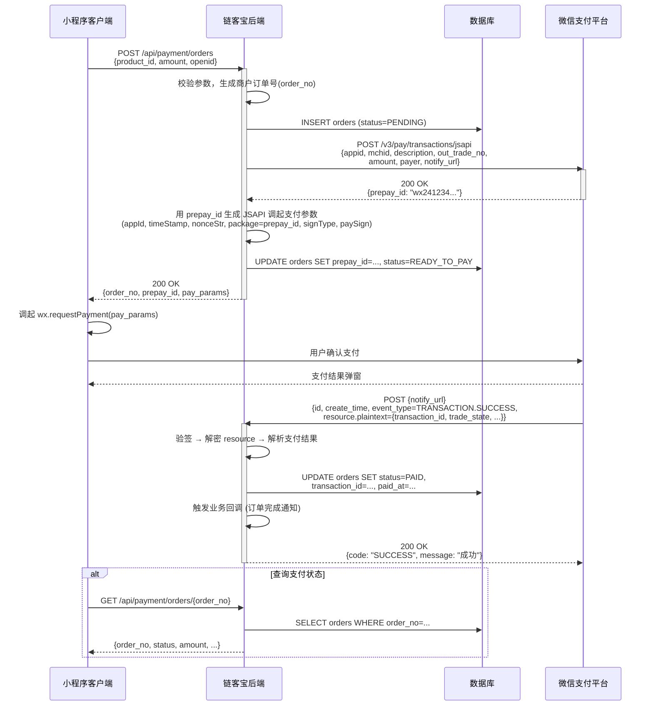

# 微信支付对接架构设计

> 基于微信支付 APIv3 + IJPay 设计模式，适用于链客宝后端服务。
> 商户号 + APIv3 密钥通过环境变量注入，敏感配置不写入代码库。

---

## 目录

1. [架构概述](#1-架构概述)
2. [环境变量与配置](#2-环境变量与配置)
3. [支付流程时序图](#3-支付流程时序图)
4. [API 端点清单](#4-api-端点清单)
5. [数据库订单表设计](#5-数据库订单表设计)
6. [安全签名方案](#6-安全签名方案)
7. [IJPay 参考模式](#7-ijpay-参考模式)
8. [目录结构建议](#8-目录结构建议)

---

## 1. 架构概述

采用**分层 + 策略模式**设计，参考 IJPay 的 `WxPayApi` / `WxV3PayApi` 分离思路：

```
┌─────────────────────────────────────────────────┐
│                  客户端 (小程序/App/H5)              │
└──────────────┬──────────────────┬────────────────┘
               │ 下单请求          │ 支付结果通知
               ▼                  ▼
┌─────────────────────────────────────────────────┐
│                 API 网关 (gateway.py)               │
│         路由 /api/payment/* → payment 服务         │
└──────────────────────┬──────────────────────────┘
                       │
┌──────────────────────▼──────────────────────────┐
│            Payment Service (FastAPI)              │
│  ┌─────────────┐  ┌──────────┐  ┌────────────┐  │
│  │ OrderRouter  │  │ Notify   │  │ Refund     │  │
│  │ (下单/查询)   │  │ (回调)    │  │ (退款)      │  │
│  └──────┬──────┘  └────┬─────┘  └─────┬──────┘  │
│         │              │              │          │
│  ┌──────┴──────────────┴──────────────┴──────┐   │
│  │          WeChatPayService (核心业务层)       │   │
│  │  - 签名生成 / 验签                           │   │
│  │  - HTTP 请求封装 (requests / httpx)         │   │
│  │  - 回调通知解析                              │   │
│  └─────────────────────┬─────────────────────┘   │
│                        │                         │
│  ┌─────────────────────▼─────────────────────┐   │
│  │         WeChatApiClient (微信API客户端)      │   │
│  │  - APIv3 认证头生成 (Authorization: WECHATPAY2-SHA256-RSA...) │
│  │  - 平台证书下载 / 缓存                       │   │
│  │  - 敏感信息加密 (AES-256-GCM)               │   │
│  └─────────────────────────────────────────────┘   │
└──────────────────────┬──────────────────────────┘
                       │
┌──────────────────────▼──────────────────────────┐
│           Database (PostgreSQL / MySQL)           │
│   orders / refunds / pay_notify_logs              │
└─────────────────────────────────────────────────┘
```

**核心职责分层：**

| 层 | 角色 | 关键类 / 模块 |
|---|---|---|
| **Router** | HTTP 入口，参数校验，响应组装 | `OrderRouter`, `NotifyRouter`, `RefundRouter` |
| **Service** | 业务编排，调用微信 API，DB 操作 | `WeChatPayService` |
| **Client** | 微信 API HTTP 通信，签名/验签 | `WeChatApiClient` |
| **Model** | 数据模型 + 枚举 | `Order`, `Refund`, `PayStatus` |

---

## 2. 环境变量与配置

```
# ── 微信支付 ── 通过环境变量注入 ──

# 商户号
WXPAY_MCHID=                    # 微信支付商户号
WXPAY_APPID=                    # 小程序/公众号 AppId

# APIv3 密钥 (32 字节 Hex)
WXPAY_API_V3_KEY=               # APIv3 密钥

# 商户 API 证书 (APIv3 使用私钥签名)
WXPAY_MCH_PRIVATE_KEY_PATH=     # 商户私钥 PEM 文件路径
WXPAY_MCH_SERIAL_NO=            # 商户证书序列号

# 支付回调地址 (部署时通过环境变量注入)
WXPAY_NOTIFY_URL=               # 支付结果回调地址
WXPAY_REFUND_NOTIFY_URL=        # 退款结果回调地址

# IJPay 模式开关 (兼容 IJPay 签名流)
WXPAY_SIGN_TYPE=WECHATPAY2-SHA256-RSA
```

**配置加载方案** (`payment/config.py`):

```python
import os
from dataclasses import dataclass, field

@dataclass
class WeChatPayConfig:
    mch_id: str = field(default_factory=lambda: os.environ["WXPAY_MCHID"])
    app_id: str = field(default_factory=lambda: os.environ["WXPAY_APPID"])
    api_v3_key: str = field(default_factory=lambda: os.environ["WXPAY_API_V3_KEY"])
    mch_private_key_path: str = field(default_factory=lambda: os.environ["WXPAY_MCH_PRIVATE_KEY_PATH"])
    mch_serial_no: str = field(default_factory=lambda: os.environ["WXPAY_MCH_SERIAL_NO"])
    notify_url: str = field(default_factory=lambda: os.environ.get("WXPAY_NOTIFY_URL", ""))
    refund_notify_url: str = field(default_factory=lambda: os.environ.get("WXPAY_REFUND_NOTIFY_URL", ""))

    # API 基础地址
    base_url: str = "https://api.mch.weixin.qq.com"
    api_v3_base: str = "https://api.mch.weixin.qq.com/v3"
```

---

## 3. 支付流程时序图

### 3.1 JSAPI（小程序）支付流程



### 3.2 退款流程

```mermaid
sequenceDiagram
    participant Admin as 管理员/系统
    participant App as 链客宝后端
    participant DB as 数据库
    participant WxPay as 微信支付平台

    Admin->>App: POST /api/payment/orders/{order_no}/refund<br/>{refund_amount, reason}
    activate App

    App->>DB: SELECT orders WHERE order_no=...<br/>校验订单是否可退款
    App->>DB: INSERT refunds (status=PROCESSING)

    App->>WxPay: POST /v3/refund/domestic/refunds<br/>{transaction_id, out_refund_no,<br/>amount.refund, amount.total, reason, notify_url}
    activate WxPay

    WxPay-->>App: 200 OK<br/>{refund_id, status=PROCESSING, ...}
    deactivate WxPay

    App->>DB: UPDATE refunds SET refund_id=..., status=PROCESSING
    App-->>Admin: 200 OK<br/>{refund_no, status: "PROCESSING"}

    WxPay->>App: POST {refund_notify_url}<br/>{event_type=REFUND.SUCCESS, resource...}
    activate App
    App->>App: 验签 → 解密 → 更新退款状态
    App->>DB: UPDATE refunds SET status=SUCCESS<br/>UPDATE orders SET status=REFUNDED
    App-->>WxPay: 200 OK
    deactivate App
    deactivate Admin
```

---

## 4. API 端点清单

### 4.1 支付订单

| 方法 | 路径 | 功能 | 请求体 / 参数 | 响应 |
|------|------|------|---------------|------|
| `POST` | `/api/payment/orders` | **创建订单 / 统一下单** | `{product_id, product_name, amount(分), openid, description?}` | `{order_no, prepay_id, pay_params}` |
| `GET` | `/api/payment/orders/{order_no}` | **查询订单状态** | 路径参数: `order_no` | `{order_no, status, amount, paid_at, ...}` |
| `POST` | `/api/payment/orders/{order_no}/close` | **关闭订单** | - | `{code: "SUCCESS"}` |
| `GET` | `/api/payment/orders` | **订单列表（分页）** | `?page=1&size=20&status=PAID` | `{items: [...], total, page, size}` |

### 4.2 支付回调

| 方法 | 路径 | 功能 | 说明 |
|------|------|------|------|
| `POST` | `/api/payment/callbacks/paid` | **支付结果通知** | 微信服务器主动推送，需验签+解密 |
| `POST` | `/api/payment/callbacks/refund` | **退款结果通知** | 微信服务器主动推送 |

### 4.3 退款

| 方法 | 路径 | 功能 | 请求体 / 参数 | 响应 |
|------|------|------|---------------|------|
| `POST` | `/api/payment/refunds` | **申请退款** | `{order_no, refund_amount, reason?}` | `{refund_no, status}` |
| `GET` | `/api/payment/refunds/{refund_no}` | **查询退款** | 路径参数: `refund_no` | `{refund_no, status, ...}` |

### 4.4 回调端点注册（微信商户平台配置）

```
支付通知URL:  https://liankebao.top/api/payment/callbacks/paid
退款通知URL:  https://liankebao.top/api/payment/callbacks/refund
```

> 注意：回调端点必须部署在 **HTTPS** 自有域名下，微信支付平台仅支持 HTTPS + 80/443 端口。

---

## 5. 数据库订单表设计

### 5.1 `pay_orders` — 支付订单表

```sql
CREATE TABLE IF NOT EXISTS pay_orders (
    id              BIGINT UNSIGNED AUTO_INCREMENT PRIMARY KEY COMMENT '自增主键',

    -- 业务标识
    order_no        VARCHAR(32)    NOT NULL COMMENT '商户订单号 (唯一)',
    app_id          VARCHAR(32)    NOT NULL COMMENT '微信 AppId',
    mch_id          VARCHAR(32)    NOT NULL COMMENT '商户号',

    -- 商品信息
    product_id      VARCHAR(64)    DEFAULT NULL COMMENT '商品 ID',
    product_name    VARCHAR(128)   NOT NULL COMMENT '商品描述',
    description     VARCHAR(256)   DEFAULT NULL COMMENT '订单备注',

    -- 金额 (单位: 分)
    total_fee       INT UNSIGNED   NOT NULL COMMENT '订单总金额 (分)',
    refund_fee      INT UNSIGNED   NOT NULL DEFAULT 0 COMMENT '已退款金额 (分)',
    fee_type        VARCHAR(8)     NOT NULL DEFAULT 'CNY' COMMENT '币种',

    -- 支付状态
    status          VARCHAR(20)    NOT NULL DEFAULT 'PENDING' COMMENT '订单状态',
    prepay_id       VARCHAR(64)    DEFAULT NULL COMMENT '微信预支付 ID',
    transaction_id  VARCHAR(64)    DEFAULT NULL COMMENT '微信支付订单号',
    trade_type      VARCHAR(16)    DEFAULT NULL COMMENT '交易类型: JSAPI / APP / NATIVE / H5',

    -- 支付方
    openid          VARCHAR(128)   DEFAULT NULL COMMENT '用户 OpenId',
    payer_unionid   VARCHAR(128)   DEFAULT NULL COMMENT '用户 UnionId',

    -- 时间
    paid_at         DATETIME       DEFAULT NULL COMMENT '支付完成时间',
    closed_at       DATETIME       DEFAULT NULL COMMENT '关闭时间',
    created_at      DATETIME       NOT NULL DEFAULT CURRENT_TIMESTAMP COMMENT '创建时间',
    updated_at      DATETIME       NOT NULL DEFAULT CURRENT_TIMESTAMP ON UPDATE CURRENT_TIMESTAMP COMMENT '更新时间',

    -- 索引
    UNIQUE INDEX uk_order_no (order_no),
    INDEX idx_status (status),
    INDEX idx_created_at (created_at),
    INDEX idx_openid (openid)
) ENGINE=InnoDB DEFAULT CHARSET=utf8mb4 COMMENT='微信支付订单表';
```

**状态机：**

```
PENDING ──→ READY_TO_PAY ──→ PAID ──→ REFUNDED (部分/全部)
    │                            │
    └──→ CLOSED                  └──→ REFUNDING
         (超时/手动关闭)
```

| 状态值 | 含义 |
|--------|------|
| `PENDING` | 订单创建，未获取 prepay_id |
| `READY_TO_PAY` | 已获取 prepay_id，等待用户支付 |
| `PAID` | 支付成功 (收到回调并验签通过) |
| `REFUNDING` | 退款处理中 |
| `REFUNDED` | 已全额退款 |
| `CLOSED` | 订单关闭 (超时未支付) |

### 5.2 `pay_refunds` — 退款记录表

```sql
CREATE TABLE IF NOT EXISTS pay_refunds (
    id              BIGINT UNSIGNED AUTO_INCREMENT PRIMARY KEY COMMENT '自增主键',

    refund_no       VARCHAR(32)    NOT NULL COMMENT '商户退款单号 (唯一)',
    order_no        VARCHAR(32)    NOT NULL COMMENT '关联订单号',
    transaction_id  VARCHAR(64)    DEFAULT NULL COMMENT '原支付交易号',
    refund_id       VARCHAR(64)    DEFAULT NULL COMMENT '微信退款单号',

    -- 金额 (分)
    total_fee       INT UNSIGNED   NOT NULL COMMENT '原订单金额',
    refund_fee      INT UNSIGNED   NOT NULL COMMENT '本次退款金额',

    -- 状态
    status          VARCHAR(20)    NOT NULL DEFAULT 'PROCESSING' COMMENT '退款状态',
    reason          VARCHAR(256)   DEFAULT NULL COMMENT '退款原因',
    refund_account  VARCHAR(32)    DEFAULT NULL COMMENT '退款入账账户',

    -- 时间
    success_at      DATETIME       DEFAULT NULL COMMENT '退款完成时间',
    created_at      DATETIME       NOT NULL DEFAULT CURRENT_TIMESTAMP,
    updated_at      DATETIME       NOT NULL DEFAULT CURRENT_TIMESTAMP ON UPDATE CURRENT_TIMESTAMP,

    UNIQUE INDEX uk_refund_no (refund_no),
    INDEX idx_order_no (order_no),
    INDEX idx_status (status)
) ENGINE=InnoDB DEFAULT CHARSET=utf8mb4 COMMENT='退款记录表';
```

### 5.3 `pay_notify_logs` — 回调通知日志表

```sql
CREATE TABLE IF NOT EXISTS pay_notify_logs (
    id              BIGINT UNSIGNED AUTO_INCREMENT PRIMARY KEY,

    event_type      VARCHAR(64)    NOT NULL COMMENT '事件类型 (TRANSACTION.SUCCESS / REFUND.SUCCESS)',
    order_no        VARCHAR(32)    DEFAULT NULL COMMENT '商户订单号',
    notify_id       VARCHAR(64)    NOT NULL COMMENT '通知 ID (唯一去重)',
    request_body    TEXT           NOT NULL COMMENT '原始请求体 (加密)',
    decrypted_body  TEXT           DEFAULT NULL COMMENT '解密后的明文',
    sign_verified   TINYINT(1)     NOT NULL DEFAULT 0 COMMENT '验签是否通过 0/1',
    process_status  VARCHAR(20)    NOT NULL DEFAULT 'PENDING' COMMENT '处理状态',

    created_at      DATETIME       NOT NULL DEFAULT CURRENT_TIMESTAMP,

    UNIQUE INDEX uk_notify_id (notify_id),
    INDEX idx_event_type (event_type),
    INDEX idx_order_no (order_no)
) ENGINE=InnoDB DEFAULT CHARSET=utf8mb4 COMMENT='支付回调日志 (幂等 / 审计)';
```

---

## 6. 安全签名方案

### 6.1 APIv3 认证头签名

微信 APIv3 所有请求使用 **WECHATPAY2-SHA256-RSA** 签名方案，核心步骤如下：

```
Authorization: WECHATPAY2-SHA256-RSA
    mchid="{mchid}",
    nonce_str="{nonce}",
    timestamp="{timestamp}",
    serial_no="{serial_no}",
    signature="{signature}"
```

**签名串构造规则：**

```
HTTP请求方法\n
URL路径\n
请求时间戳\n
随机字符串\n
请求体 (GET/无体请求时为空字符串)\n
```

**签名算法：**

```python
import hashlib
import time
import uuid
from cryptography.hazmat.primitives import hashes, serialization
from cryptography.hazmat.primitives.asymmetric import padding

def build_signature(method: str, url_path: str, body: str, private_key_pem: str) -> tuple:
    """
    生成 APIv3 认证头所需参数。

    返回: (nonce, timestamp, signature, serial_no)
    """
    nonce = str(uuid.uuid4()).replace("-", "")
    timestamp = str(int(time.time()))

    # 构造签名串
    message = f"{method}\n{url_path}\n{timestamp}\n{nonce}\n{body}\n"

    # 加载私钥
    private_key = serialization.load_pem_private_key(
        private_key_pem.encode("utf-8") if isinstance(private_key_pem, str) else private_key_pem,
        password=None,
    )

    # SHA256-RSA 签名
    signature = private_key.sign(
        message.encode("utf-8"),
        padding.PKCS1v15(),
        hashes.SHA256(),
    )

    return nonce, timestamp, base64.b64encode(signature).decode("utf-8")
```

### 6.2 回调通知验签

微信支付回调通知的验签流程（反向验证签名）：

```
步骤 1: 从 HTTP 头 Wechatpay-Serial 获取平台证书序列号
步骤 2: 用该序列号查找本地缓存的平台证书
步骤 3: 从 HTTP 头 Wechatpay-Signature 获取签名值
步骤 4: 构造验签串:
    {timestamp}\n{nonce}\n{ciphertext(or body)}\n
    — 其中 timestamp/nonce 来自 HTTP 头 Wechatpay-Timestamp / Wechatpay-Nonce
步骤 5: 用平台证书公钥验签 (SHA256-RSA)
步骤 6: 验签通过后用 APIv3 密钥解密 resource.ciphertext (AES-256-GCM)
```

```python
def verify_notify_signature(
    headers: dict,
    body: str,
    platform_cert_pem: str,
) -> bool:
    """
    验证微信回调通知签名。
    """
    wechatpay_signature = headers.get("Wechatpay-Signature", "")
    wechatpay_timestamp = headers.get("Wechatpay-Timestamp", "")
    wechatpay_nonce = headers.get("Wechatpay-Nonce", "")

    # 构造验签串
    sign_str = f"{wechatpay_timestamp}\n{wechatpay_nonce}\n{body}\n"

    # 加载平台证书公钥
    cert = x509.load_pem_x509_certificate(platform_cert_pem.encode("utf-8"))
    public_key = cert.public_key()

    try:
        public_key.verify(
            base64.b64decode(wechatpay_signature),
            sign_str.encode("utf-8"),
            padding.PKCS1v15(),
            hashes.SHA256(),
        )
        return True
    except Exception:
        return False
```

### 6.3 敏感信息加密 (AES-256-GCM)

微信 APIv3 涉及敏感字段（如 `payer.name`, `payer.id_card`）时使用 **AES-256-GCM** 加密。

加密使用商户私钥 + 平台公钥协商的对称密钥，实际应用参考 **IJPay** 的 `WxV3PayApi.encryptData()`。

```python
from cryptography.hazmat.primitives.ciphers.aead import AESGCM

def decrypt_resource(ciphertext_b64: str, nonce_b64: str, associated_data: str, api_v3_key: str) -> str:
    """
    解密微信回调 resource 中的 ciphertext。
    """
    key = api_v3_key.encode("utf-8")  # APIv3 密钥 32 字节
    nonce = base64.b64decode(nonce_b64)
    ciphertext = base64.b64decode(ciphertext_b64)
    aad = associated_data.encode("utf-8")

    aesgcm = AESGCM(key)
    plaintext = aesgcm.decrypt(nonce, ciphertext, aad)
    return plaintext.decode("utf-8")
```

### 6.4 平台证书自动下载与缓存

微信 APIv3 要求使用平台证书公钥验签。平台证书会定期更换，建议实现自动下载和缓存：

```python
class PlatformCertificateManager:
    """
    平台证书管理器。

    参考 IJPay: WxV3PayApi.downloadCertificate()
    """

    def __init__(self, api_client: "WeChatApiClient", api_v3_key: str):
        self.client = api_client
        self.api_v3_key = api_v3_key
        self._cache: dict[str, x509.Certificate] = {}  # serial_no -> cert

    def get_certificate(self, serial_no: str) -> x509.Certificate | None:
        """获取平台证书，缓存命中优先，否则从微信下载。"""
        if serial_no in self._cache:
            return self._cache[serial_no]

        # GET /v3/certificates
        resp = self.client.get("/v3/certificates")
        for cert_data in resp.json()["data"]:
            # 解密 certificate -> 缓存
            plain = decrypt_resource(
                cert_data["encrypt_certificate"]["ciphertext"],
                cert_data["encrypt_certificate"]["nonce"],
                cert_data["encrypt_certificate"]["associated_data"],
                self.api_v3_key,
            )
            cert = x509.load_pem_x509_certificate(plain.encode("utf-8"))
            serial = cert.serial_number
            self._cache[serial] = cert

        return self._cache.get(serial_no)
```

### 6.5 签名安全要点总结

| 项目 | 说明 |
|------|------|
| 私钥存储 | 文件系统 PEM 文件，**禁止**硬编码在代码中 |
| APIv3 密钥 | 环境变量注入，用于 AES 解密回调 resource |
| 平台证书 | 自动下载 + 内存缓存，验证回调签名 |
| 验签失败 | 返回 `401 Unauthorized`，记录告警日志 |
| 幂等处理 | 通过 `notify_id` 唯一索引防止重复回调 |
| 时序攻击 | 验签和比较使用恒定时间函数 |

---

## 7. IJPay 参考模式

IJPay 是 Java 生态中流行的微信/支付宝支付封装库。以下对比说明本架构如何参考其设计：

### 7.1 IJPay 核心抽象

| IJPay 组件 | 本架构对应 | 说明 |
|---|---|---|
| `WxPayApi` | `WeChatApiClient` | 微信 API HTTP 通信层 |
| `WxV3PayApi` | `WeChatApiClient.v3_*()` | APIv3 特化方法 |
| `WxPayModel` / `WxV3Model` | `OrderCreateRequest` / `OrderCreateResponse` | 请求/响应 DTO |
| `IWxPayConfig` | `WeChatPayConfig` | 配置接口 |
| `PayHub` / `PayFactory` | `PaymentServiceFactory` | 多支付渠道工厂 (可选) |

### 7.2 推荐 DTO 模式 (参考 IJPay Model)

```python
# payment/models/request.py
from dataclasses import dataclass, field
from typing import Optional

@dataclass
class OrderCreateRequest:
    """统一下单请求 — 参考 IJPay WxV3PayApi.create()"""
    description: str          # 商品描述
    out_trade_no: str         # 商户订单号
    amount: int               # 订单金额 (分)
    openid: str               # 用户标识
    attach: Optional[str] = None   # 附加数据
    goods_tag: Optional[str] = None
    time_expire: Optional[str] = None  # 订单过期时间 (RFC 3339)

    def to_wechat_dict(self) -> dict:
        """序列化为微信 API 请求体 (参考 IJPay Model 的 toMap())"""
        return {
            "appid": os.environ["WXPAY_APPID"],
            "mchid": os.environ["WXPAY_MCHID"],
            "description": self.description,
            "out_trade_no": self.out_trade_no,
            "notify_url": os.environ["WXPAY_NOTIFY_URL"],
            "amount": {"total": self.amount},
            "payer": {"openid": self.openid},
        }


@dataclass
class OrderQueryResponse:
    """订单查询响应"""
    code: Optional[str]       # 错误码
    message: Optional[str]    # 错误信息
    transaction_id: Optional[str]
    trade_state: str          # SUCCESS / NOTPAY / CLOSED / REFUND
    trade_state_desc: str
    amount_total: Optional[int]
    payer_openid: Optional[str]
    success_time: Optional[str]

    @classmethod
    def from_wechat(cls, data: dict) -> "OrderQueryResponse":
        """从微信响应反序列化 (参考 IJPay 的 Model 反序列化)"""
        return cls(
            code=data.get("code"),
            message=data.get("message"),
            transaction_id=data.get("transaction_id"),
            trade_state=data.get("trade_state"),
            trade_state_desc=data.get("trade_state_desc", ""),
            amount_total=data.get("amount", {}).get("total"),
            payer_openid=data.get("payer", {}).get("openid"),
            success_time=data.get("success_time"),
        )
```

### 7.3 统一异常处理 (参考 IJPay 的 PayException)

```python
# payment/exceptions.py
class WeChatPayException(Exception):
    """微信支付异常基类 (参考 IJPay PayException)"""

    def __init__(self, code: str, message: str, wechat_response: dict | None = None):
        self.code = code
        self.message = message
        self.wechat_response = wechat_response
        super().__init__(f"[{code}] {message}")


class SignatureVerifyException(WeChatPayException):
    """验签失败"""
    pass


class OrderNotExistsException(WeChatPayException):
    """订单不存在"""
    def __init__(self, order_no: str):
        super().__init__("ORDER_NOT_EXISTS", f"订单 {order_no} 不存在")
```

---

## 8. 目录结构建议

```
D:/chainke-full/payment/
├── ARCHITECTURE.md              # ← 本文档
├── __init__.py
├── config.py                    # WeChatPayConfig
├── exceptions.py                # 异常定义
│
├── client/
│   ├── __init__.py
│   ├── api_client.py            # WeChatApiClient (HTTP + 签名)
│   └── cert_manager.py          # PlatformCertificateManager
│
├── models/
│   ├── __init__.py
│   ├── request.py               # 请求 DTO
│   ├── response.py              # 响应 DTO
│   └── enums.py                 # PayStatus, TradeType
│
├── service/
│   ├── __init__.py
│   ├── pay_service.py           # WeChatPayService (下单 + 查询)
│   ├── notify_service.py        # 回调处理
│   └── refund_service.py        # 退款
│
├── router/
│   ├── __init__.py
│   ├── order_router.py          # /api/payment/orders/*
│   ├── callback_router.py       # /api/payment/callbacks/*
│   └── refund_router.py        # /api/payment/refunds/*
│
├── repository/
│   ├── __init__.py
│   ├── order_repo.py            # 订单表 CRUD
│   ├── refund_repo.py           # 退款表 CRUD
│   └── notify_log_repo.py       # 回调日志
│
└── utils/
    ├── __init__.py
    ├── signature.py             # 签名 / 验签工具
    ├── crypto.py                # AES-256-GCM 加解密
    └── helpers.py               # 订单号生成等
```

---

## 附录 A: 快速集成清单

- [ ] 在链客宝后端 `backend/app/main.py` 中注册 `payment/router/*` 路由
- [ ] 在 `gateway.py` 中添加 `/api/payment/* → localhost:8001` 路由规则
- [ ] 设置环境变量 `WXPAY_MCHID`, `WXPAY_APPID`, `WXPAY_API_V3_KEY`, `WXPAY_MCH_PRIVATE_KEY_PATH`, `WXPAY_MCH_SERIAL_NO`
- [ ] 在微信商户平台配置支付回调 URL
- [ ] 执行 `pay_orders` / `pay_refunds` / `pay_notify_logs` 建表 SQL
- [ ] 商户私钥 PEM 文件部署到服务器 (勿入版本管理)
- [ ] 编写 `WeChatApiClient` 并实现平台证书自动下载缓存
- [ ] 对接小程序端 `wx.requestPayment()` 调用

---

## 附录 B: 参考资料

- [微信支付 APIv3 官方文档](https://pay.weixin.qq.com/wiki/doc/apiv3/index.shtml)
- [IJPay GitHub](https://github.com/Javen205/IJPay) — Java 支付 SDK 参考
- [微信支付 APIv3 签名文档](https://pay.weixin.qq.com/wiki/doc/apiv3/wechatpay/wechatpay4_0.shtml)
- [微信支付回调通知文档](https://pay.weixin.qq.com/wiki/doc/apiv3/wechatpay/wechatpay6_0.shtml)
